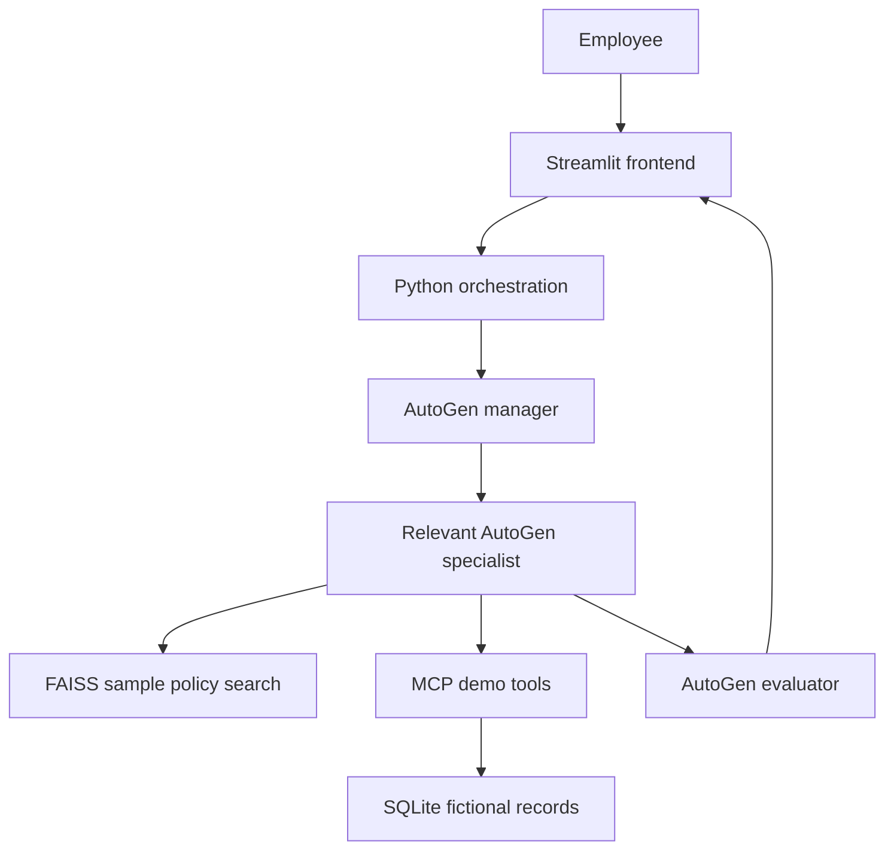

# Corporate Employee Support Desk

An assignment demo of a multi-agent employee support chatbot. Employees can ask about sample company policies, check fictional personal records, and create a demo IT ticket. An AutoGen manager chooses the relevant specialist, and an evaluator reviews the response before it appears in the Streamlit chat.

> **Demo only.** The account selector does not authenticate users. Policies and employee records are fictional. Do not enter real employee data or deploy this app for actual staff.

## What you can demonstrate

| Request | What happens |
| --- | --- |
| “How many casual leaves do I have?” | The manager routes to leave support; an MCP tool reads the selected demo employee's leave balance. |
| “How do I book travel for a client meeting?” | The travel specialist uses relevant sample policy excerpts from FAISS retrieval. The UI can show the source policy file. |
| “What is the status of claim CLM100?” | The finance specialist gets the claim status through an MCP tool. `CLM100` belongs to `EMP001`. |
| “Create an IT ticket because my VPN fails after MFA.” | The app asks for confirmation. Only clicking **Create demo ticket** writes the ticket to SQLite. |
| “What is the status of ticket IT100?” | The MCP tool checks the selected employee's ticket. `IT100` belongs to `EMP001`. |

`EMP001` starts with 5 casual and 7 sick leave days; `EMP002` starts with 2 casual and 4 sick leave days. These are seeded demo values, not company policy.

## Architecture



The backend is a Python package imported directly by Streamlit. The MCP server starts locally over **stdio** when a tool is called. There is no FastAPI service, external ticketing integration, or HTTP API in this repository.

The manager may select up to three specialists. Policy search is limited to files mapped to each specialist. The evaluator can pass a draft, ask for a revision, request clarification, block it, or escalate. These controls reduce unsupported answers; they do not guarantee factual correctness.

## Project structure

```text
corporate_employee_ai/
├── frontend/
│   └── app.py                 Streamlit chat, topic buttons, source display, ticket confirmation
├── backend/
│   ├── agents/__init__.py     AutoGen manager, specialists, evaluator, model client
│   ├── orchestration/
│   │   ├── schemas.py         Structured route and review results
│   │   └── workflow.py        Request routing, evidence gathering, review, actions
│   ├── rag/retrieval.py       Policy loading, embeddings, FAISS search, local cache
│   └── mcp/
│       ├── client.py          Allowlisted local stdio tool calls
│       ├── server.py          MCP tool definitions
│       └── storage.py         Seeded SQLite records and demo tickets
├── data/                      Fictional company, leave, finance, IT, travel policies
├── tests/                     Offline tests for UI, retrieval, workflow, MCP
├── .env.example
└── requirements.txt
```

## Run on Windows

Use Python **3.11** from the `corporate_employee_ai` directory.

### Command Prompt (CMD)

```bat
py -3.11 -m venv .venv
.venv\Scripts\activate.bat
python -m pip install --upgrade pip
python -m pip install -r requirements.txt
copy .env.example .env
notepad .env
python -m streamlit run frontend/app.py
```

### PowerShell

```powershell
py -3.11 -m venv .venv
.\.venv\Scripts\Activate.ps1
python -m pip install --upgrade pip
python -m pip install -r requirements.txt
Copy-Item .env.example .env
notepad .env
python -m streamlit run frontend/app.py
```

If PowerShell blocks activation, run `Set-ExecutionPolicy -Scope Process Bypass` in that terminal, then activate again. Alternatively use CMD.

In `.env`, set your own key:

```dotenv
OPENAI_API_KEY=your_key_here
OPENAI_MODEL=gpt-4o-mini
EMBEDDING_MODEL=text-embedding-3-small
```

Open the local URL printed by Streamlit, usually `http://localhost:8501`. The app needs an API key and network access for OpenAI chat and embeddings. Initial policy indexing makes embedding requests; subsequent starts reuse the local `.cache/policy_embeddings.npz` while the model and source text stay the same. API usage may incur charges.

## Suggested demo sequence

1. Select `EMP001` and ask **How many casual leaves do I have?** Observe the demo record answer.
2. Ask **How do I book travel for a client meeting?** Open the policy references under the answer.
3. Ask **What is the status of claim CLM100?** Observe the account-specific demo claim.
4. Ask **Create an IT ticket because my VPN fails after MFA.** Click **Create demo ticket** and note the returned ID.
5. Ask for that ticket's status using the ID actually returned.

The travel answer depends on the sample `data/travel.md` and the model's review. If the available material cannot support an answer, the application should ask for clarification or escalate instead of inventing a rule.

## Tests and reset

Run the offline test suite from the project root:

```bat
python -m pytest -q tests
```

The tests check UI rendering, retrieval behavior, request flow, confirmation, and record ownership. They use simulated model decisions and do **not** certify live model output. For a live check, run the demo questions above and compare responses with the policy files and demo records.

Demo records and created tickets live in `data/demo_records.sqlite3`. Stop the app, then delete that file to restore the initial fictional records on the next tool call. The embedding cache is under `.cache/`; it rebuilds if the policy text or embedding model changes.

## Boundaries and next steps

- The account dropdown selects a fictional identity; it is not SSO or authorization.
- Some visible support areas have no policy file in this demo. Those requests may be escalated rather than answered.
- Only demo leave balances, claim statuses, IT ticket statuses, and IT ticket creation have MCP tools. Other requests are answered from the sample policy files where possible.
- The evaluator is another language model. Human review and grounded test cases are still necessary before relying on answers.
- A real deployment needs authenticated identity supplied server-side, tool-level authorization, document permissions, audit logs, secure secret handling, approved company policies, and actual HR/IT integrations.

This repository is intended to explain and demonstrate the architecture, not to serve as a production employee portal.